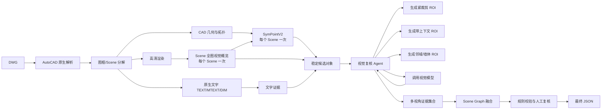

# CAD 全景识别统一架构开发总规约

版本：`0.2.0`

状态：当前架构基线

适用范围：DWG 输入、AutoCAD 2020-2027 本地解析、SymPointV2 云端推理、原生文字融合、受限视觉复核和统一 Scene Graph 输出。

本文档是当前项目的总体开发入口。局部实现细节分别见：

- [DWG 视觉识别系统架构与数据交互设计](DWG_VISION_ARCHITECTURE.md)
- [SymPointV2 云端推理接口开发文档](SYMPOINT_REMOTE_API_IMPLEMENTATION.md)

## 1. 架构结论

当前方案采用“稳定主链路 + 有界智能增强”的结构，唯一主架构流程见第 3 节。后续文档中的 API、Schema、LLM 和规则实现都只能展开主流程节点，不能新增或改变主流程。

冻结的设计决策：

1. 输入格式第一阶段只支持 DWG；不把 DXF、PDF、图片混入主契约。
2. DWG 原生解析、坐标、Handle、文字和尺寸由本地 AutoCAD 模块负责。
3. SymPointV2 部署在 Linux GPU 云端，输入是 Scene Bundle，不直接读取 DWG。
4. 每个逻辑 Scene 在下游处理前先执行一次全图视觉概览；该调用是 Scene 级先验，不修改 CAD 事实。
5. SymPointV2 对每个逻辑 Scene 只执行一次推理；不得由 Agent 重复调用。
6. 视觉模型可以多次调用，但只能在固定 ROI 模板、固定预算和固定状态机内调用。
7. 不使用可以自由规划整个 CAD 流程的全局 CAD Agent。
8. 原生文字对语义类别具有高权重；CAD 原生几何对坐标、尺寸、拓扑和实体身份具有最高权威。
9. 模型不能覆盖、修改或伪造 DWG 原始事实；冲突必须保留并进入校验结果。
10. 所有模型输出都必须带来源、版本、置信度和可审计证据。
11. 视觉模型的隐藏思维过程不作为系统契约；只保存简短的可验证观察、依据、不确定性和冲突。

## 2. 系统边界与责任

### 2.1 本地 Windows 侧

本地侧拥有 DWG 原文件和 AutoCAD 2020-2027 环境，负责：

- 打开和读取 DWG；
- 读取实体、块、图层、字体、文字、尺寸、引线和布局；
- 识别图框、Layout、Viewport 和 Scene；
- 生成世界坐标到 Scene 局部坐标的变换；
- 生成 `scene.json`、`scene.svg` 和 Bundle ZIP；
- 生成高清渲染图和视觉 ROI；
- 对每个 Scene 的高清图先调用一次全图视觉概览，并保存可审计结果；
- 调用云端 SymPointV2 API；
- 将云端结果映射回 DWG Handle 和世界坐标；
- 执行最终规则校验和 Scene Graph 提交。

### 2.2 云端 Linux 侧

云端只负责稳定的 SymPointV2 推理服务：

- 常驻加载模型、权重和 pointops；
- 接收 Bundle ZIP；
- 校验 `job_manifest.json` 和 Scene 文件；
- 生成 `_s2.json`；
- 每个 Scene 执行一次 SymPointV2 前向；
- 返回 primitive 级语义结果和 instance 级结果；
- 保存模型、配置和权重哈希；
- 提供异步 Job 查询和结果下载。

云端不负责：

- 读取原始 DWG；
- 解释 AutoCAD Handle；
- 修改 DWG；
- 决定最终文字语义；
- 自由调用视觉模型；
- 生成最终工程结论。

## 3. 总体流程图



实现说明：`D3` 生成的每个 Scene 高清图先进入一次 `Scene 全图视觉概览`，用于提供房间/区域、全局对象假设、文字观察和疑点区域等先验；随后才调用每个 Scene 一次的 SymPointV2。之后 Agent 只能在固定 ROI 模板和预算内继续复核。`Scene Graph 融合` 节点内部可以使用 LLM 做结构化证据融合，但 LLM 不是主流程中的独立架构节点。

## 4. 核心对象和数据流

系统中的数据分为四类：

| 数据类型 | 权威来源 | 是否可被模型覆盖 |
|---|---|---|
| 原始 CAD 事实 | AutoCAD API | 不可覆盖 |
| 几何候选 | SymPointV2 / 几何规则 | 可被标记低置信度，不可删除原始事实 |
| 语义证据 | 原生文字 / 视觉观察 / 块名 | 可重新融合，但必须保留来源 |
| 最终对象 | Scene Graph 规则提交 | 只能由通过校验的融合结果生成 |

### 4.1 原始实体 `dwg_raw.v1`

```json
{
  "schema_version": "dwg_raw.v1",
  "job_id": "job_20260826_0001",
  "source": {
    "filename": "plan_01.dwg",
    "sha256": "...",
    "autocad_version": "AutoCAD 2027"
  },
  "raw_entities": [
    {
      "entity_id": "ent_00031",
      "handle": "7A3",
      "entity_type": "Polyline",
      "space": "ModelSpace",
      "layer": "A-WALL",
      "geometry_world": {
        "points": [[1000, 2000], [5000, 2000]],
        "bbox": [1000, 2000, 5000, 2200]
      },
      "source": "autocad_2026_api",
      "is_frame": false
    }
  ],
  "entities": [],
  "annotations": [],
  "frames": []
}
```

`raw_entities` 是 SceneBuilder 的完整几何输入，必须包含未分类图元；`entities` 只是兼容旧接口的已分类候选，不能替代 `raw_entities`。文字和 DIM 放在 `annotations`，图框候选放在 `frames`。必须保留 `entity_id`、`handle`、原始图层、空间、几何和来源。任何下游结果都通过这些 ID 回溯，不允许只使用模型生成的临时编号。

### 4.2 Scene `dwg_scene.v1`

```json
{
  "schema_version": "dwg_scene.v1",
  "scene_id": "scene_model_01_frame_03",
  "coordinate_space": "scene_local",
  "world_bounds": [1000, 2000, 8500, 6200],
  "local_bounds": [0, 0, 7800, 4500],
  "local_to_world": {
    "origin": [850, 1850],
    "scale": 1.0,
    "rotation_deg": 0.0
  },
  "primitives": [],
  "text_ids": ["txt_00019"],
  "source_entity_ids": ["ent_00031"]
}
```

Scene 是系统的最小推理边界。一个 DWG 可以生成多个 Scene，但一个 Scene 不能混入无关图框、标题栏和其他 Layout 的内容。

### 4.3 原生文字证据 `text_evidence.v1`

```json
{
  "text_id": "txt_00019",
  "scene_id": "scene_model_01_frame_03",
  "handle": "A91",
  "text": "卫生间",
  "normalized_text": "卫生间",
  "entity_type": "MText",
  "role": "room_label",
  "position_world": [5200, 3000],
  "bbox_world": [5000, 2880, 5400, 3120],
  "style": {
    "text_style": "Standard",
    "font_file": "simsun.ttf",
    "height": 180,
    "rotation_deg": 0
  },
  "source": "autocad_2026_api"
}
```

文字角色至少包括：

- `equipment_label`：设备、洁具和家具标注；
- `room_label`：房间名称；
- `door_window_tag`：门窗编号；
- `dimension`：尺寸、标高和距离；
- `legend`：图例；
- `title_block`：图签；
- `general_annotation`：普通说明。

文字归属必须先于融合。标题栏和图例不能与直接指向设备的文字享有相同权重。

### 4.4 云端输入 Bundle

Bundle ZIP 的固定结构：

```text
job_bundle/
├── job_manifest.json
└── scenes/
    └── scene_model_01_frame_03/
        ├── scene.json
        └── scene.svg
```

`job_manifest.json`：

```json
{
  "schema_version": "sympoint_job.v1",
  "job_id": "job_20260826_0001",
  "source": {
    "filename": "plan_01.dwg",
    "sha256": "..."
  },
  "model": {
    "name": "SymPointV2",
    "config": "configs/svg/svg_pointT.yaml",
    "weights": "best.pth"
  },
  "scenes": [
    {
      "scene_id": "scene_model_01_frame_03",
      "path": "scenes/scene_model_01_frame_03",
      "input_format": "svg"
    }
  ]
}
```

云端 API 当前只接收 Bundle ZIP，不接收原始 DWG。云端返回的结果必须通过 `primitive_id` 反查本地 `scene.json`，不能把云端预测框当作最终世界坐标事实。

### 4.5 SymPointV2 输出 `sympoint_result.v1`

```json
{
  "schema_version": "sympoint_result.v1",
  "scene_id": "scene_model_01_frame_03",
  "input": {
    "primitive_count": 1860,
    "padded_count": 2048
  },
  "instances": [
    {
      "instance_id": "spv_scene_0007",
      "class_id": 26,
      "class_name": "toilet",
      "score": 0.84,
      "primitive_indices": [181, 182],
      "primitive_ids": ["prim_0181", "prim_0182"]
    }
  ],
  "semantic_by_primitive": [],
  "provenance": {
    "model": "SymPointV2",
    "weights_sha256": "...",
    "config_sha256": "...",
    "runtime_version": "sympoint-api-1.0.0"
  }
}
```

约束：

- 一个逻辑 Scene 只执行一次 SymPointV2 forward；
- `primitive_ids` 必须存在于输入 Scene；
- 补零点不能进入实例结果；
- 云端结果不负责最终世界坐标；
- 低置信度结果保留，由后续融合决定是否进入正式对象。

当前云端实现对小于模型最小输入长度的 Scene 自动补零。若未来模型存在严格最大点数限制，必须采用版本化、确定性的预处理策略，禁止随机丢点，也不得由视觉 Agent 临时决定裁剪方式。

### 4.6 Scene 全图视觉概览 `visual_scene_overview.v1`

启用视觉阶段时，每个 Scene 必须在 SymPointV2 前对该 Scene-local 高清图执行一次全图调用。该调用不是候选检测结果，也不是自由 Agent；它只产生可审计的全局先验，供候选关联、ROI 选择和后续融合参考。

```json
{
  "schema_version": "visual_scene_overview.v1",
  "scene_id": "scene_model_01_frame_03",
  "view_profile": "scene_overview",
  "image_path": "scenes/scene_model_01_frame_03/scene.png",
  "model": "vision-model-a",
  "status": "completed",
  "scene_summary": "住宅平面图，包含客餐厅、卧室和卫生间区域",
  "rooms_or_zones": [{"name": "卫生间", "evidence": "闭合墙体和洁具集中区域"}],
  "global_object_hypotheses": [{"type": "furniture", "subtype": "toilet", "region": "卫生间", "evidence": "可见洁具轮廓", "confidence": 0.82}],
  "text_observations": [{"text": "WC", "meaning": "卫生间/坐便器相关标注", "confidence": 0.91}],
  "review_regions": [{"region": "卫生间西侧", "reason": "符号和文字需要局部核验"}],
  "global_warnings": [],
  "notes": "仅作为先验，不修改 CAD 几何、坐标和 Handle"
}
```

一次调用的边界是 `scene_id + scene-local 全图渲染 + 模型版本 + prompt_version`。调用失败时保留失败 trace，主链路降级继续；不能用失败结果伪造概览，也不能因此重复调用 SymPointV2。

### 4.7 视觉观察 `visual_observation.v1`

视觉模型只返回一轮观察：

```json
{
  "observation_id": "vlm_0012",
  "scene_id": "scene_model_01_frame_03",
  "object_id": "obj_000123",
  "view_profile": "wall_context",
  "model": "vision-model-a",
  "category": "wall_hung_toilet",
  "confidence": 0.79,
  "visible_facts": ["对象靠墙", "后侧存在安装线条"],
  "uncertainty": ["无法确认品牌和精确尺寸"],
  "contradictions": []
}
```

不保存不可审计的隐藏思维链。`visible_facts` 必须描述图像中可复核的事实，不能写成没有证据的结论。

### 4.8 最终 Scene Graph `scene_graph.v1`

```json
{
  "schema_version": "scene_graph.v1",
  "job_id": "job_20260826_0001",
  "scenes": [
    {
      "scene_id": "scene_model_01_frame_03",
      "objects": [
        {
          "object_id": "obj_000123",
          "type": "furniture",
          "subtype": "wall_hung_toilet",
          "geometry_world": {
            "bbox": [5300, 3050, 5650, 3350],
            "polygon": []
          },
          "source_handles": ["A81", "A82"],
          "confidence": 0.86,
          "status": "confirmed",
          "evidence_refs": ["spv_scene_0007", "vlm_0012", "txt_00031"]
        }
      ],
      "validation": {
        "status": "pass",
        "issues": []
      }
    }
  ]
}
```

## 5. 证据优先级和冲突规则

### 5.1 按字段分配权威来源

| 字段 | 主要权威来源 | 辅助来源 |
|---|---|---|
| 世界坐标、尺寸、边界 | AutoCAD 原生几何 | SymPointV2、视觉框 |
| Handle、实体身份 | AutoCAD 原生 Handle | primitive 映射 |
| 墙体连续性和拓扑 | CAD 几何、图层、规则 | SymPointV2 |
| 设备/家具语义 | 直接文字、属性、引线 | 视觉观察、SymPointV2 |
| 门窗类别 | 文字、块属性、几何 | SymPointV2、视觉观察 |
| 家具/洁具细分类 | 文字 + 视觉 + 几何关系 | SymPointV2 粗类别 |
| 是否冲突 | 规则引擎 | LLM 解释和归纳 |

### 5.2 文字高权重的实际实现

文字高权重不是简单的“只要出现文字就覆盖模型”。融合前必须计算：

```text
text_relevance
  = 文字角色权重
  × 指向关系权重
  × 空间距离权重
  × 图层/块属性权重
  × 文本解析置信度
```

建议优先级：

1. MLeader 或 Block Attribute 直接指向对象的设备文字；
2. 与对象近邻且位于同一房间的设备文字；
3. 房间名称和局部说明；
4. 图例文字；
5. 标题栏和全局说明。

如果文字是“坐便器”，但 SymPointV2 预测为 `sink`：

- 不删除任何证据；
- 最终语义优先选择 `toilet`；
- 记录 `TEXT_MODEL_CONFLICT`；
- 检查文字是否确实归属于该对象；
- 低归属置信度时进入人工复核。

如果文字和明显几何都冲突：

- 坐标和边界仍使用 CAD 几何；
- 语义标记为 `conflict` 或 `review`；
- 禁止 LLM 凭空选择一个没有证据的类别。

## 6. 受限视觉复核 Agent

视觉模块只存在于固定视觉边界内，分为“每 Scene 一次的全图概览”和“候选对象的受限复核”两个阶段，不是整个 CAD 系统的总控制器。全图概览完成后才进入 SymPointV2 和候选级 ROI 复核。

### 6.1 Agent 输入

- `scene_id` 和 `object_id`；
- 已完成的 `visual_scene_overview.v1`（若调用失败则携带失败状态）；
- SymPointV2 候选；
- 相关原生文字；
- 固定渲染清单；
- 允许的视图模板；
- 剩余调用预算；
- 当前已存在的 observations。

### 6.2 允许的视图模板

| 模板 | 用途 |
|---|---|
| `tight` | 判断对象自身符号 |
| `context` | 判断房间和邻接关系 |
| `wall_context` | 判断靠墙、嵌入、壁挂 |
| `text_context` | 同时显示对象和附近原生文字 |
| `overview` | 固定为 Scene 级前置调用，每个 Scene 一次；不作为候选级重试 |

### 6.3 默认预算

```json
{
  "max_attempts_per_object": 3,
  "max_attempts_per_scene": 30,
  "stop_on_agreement": true,
  "timeout_ms_per_call": 30000,
  "allowed_models": ["ark-vision", "deepseek-vision"]
}
```

停止条件：

1. 两个独立视图得到相同类别；
2. 一次高置信度观察同时得到文字和几何关系支持；
3. 达到对象或 Scene 预算；
4. 结果持续冲突，转人工复核；
5. 已得到满足当前字段决策所需的最小证据。

每次调用必须保存：`view_id`、`view_profile`、`crop_world`、`image_hash`、模型名、提示词版本、响应摘要和耗时。缓存键为：

```text
scene_id + object_id + view_profile + image_hash + model + prompt_version
```

候选级 ROI 提示词必须携带 `visual_scene_overview.v1` 的压缩摘要（房间/区域、全局假设、文字观察和疑点区域），并明确标记为“待核验先验”。如果概览缺失或失败，ROI 复核仍可运行，但 `visual_review_trace.json.scene_overview_used` 必须为 `false`。

## 7. 本地和云端模块划分

| 模块 | 部署 | 输入 | 输出 | 状态 |
|---|---|---|---|---|
| `DwgExtractor` | Windows / C# | DWG | `dwg_raw.v1` | 主链路 |
| `DwgBridge` | Windows / Python COM | DWG | 原生 JSON | 复现/调试 |
| `FrameDetector` | Windows | 原生实体 | `frames.v1` | 主链路 |
| `SceneBuilder` | Windows | 实体 + 图框 | `scene.json` / `scene.svg` | 主链路 |
| `TextExtractor` | Windows / C# | TEXT/MTEXT/DIM/MLeader | `text_evidence.v1` | 主链路 |
| `RasterRenderer` | Windows | Scene | PNG + manifest | 主链路 |
| `SceneOverview` | Windows/视觉服务 | Scene 高清图 + 原生文字摘要 | `visual_scene_overview.v1` | 视觉阶段每 Scene 一次 |
| `SymPointRemoteClient` | Windows | Bundle ZIP | Job 结果 | 主链路 |
| `SymPointRuntime` | Linux GPU | Bundle ZIP | `sympoint_result.v1` | 已实现云端 |
| `CandidateLinker` | Windows | 多源候选 | 关联候选 | 主链路 |
| `VisualReviewAgent` | Windows/云端 | Scene 概览 + 候选 + ROI | overview + observations | 增强链路 |
| `FusionResolver` | Windows/云端 | 结构化证据 | 字段决策 | 增强链路 |
| `Validator` | Windows | Scene Graph | 校验报告 | 主链路 |
| `SceneGraphCommitter` | Windows | 决策 + 校验 | `detection.json` | 主链路 |

### 7.1 当前本地代码对应关系

本地实现已经按上述职责拆分，OpenCode 后续修改必须优先复用这些模块，不得重新引入一个自由规划整个流程的 CAD Agent。当前 Python ActiveX 桥接兼容 2020-2027 的常见 COM ProgID，并记录实际版本；C# AutoCAD 插件不承诺一个 DLL 跨全部年份，按目标 AutoCAD/.NET SDK 单独编译：

| 主流程节点 | 本地实现 |
|---|---|
| AutoCAD 原生解析 | `dwg_vision.autocad_bridge`、`autocad_2026/DwgVisionExport.cs` |
| 图框/Scene 分解 | `dwg_vision.scene.detect_frames`、`build_scene` |
| Scene Bundle | `dwg_vision.scene.build_scene_bundle` |
| SymPointV2 每 Scene 一次 | `dwg_vision.sympoint_client.SymPointRemoteClient` |
| Scene 全图视觉概览与视觉复核 | `dwg_vision.visual_review_agent.VisualReviewAgent`，每 Scene 一次概览，候选级固定 ROI 和预算 |
| Scene Graph 融合 | `dwg_vision.scene_graph.build_scene_graph`；可选 `dwg_vision.llm_fusion` |
| 最终 JSON | `dwg_vision.orchestrator.run_full_pipeline` |

主入口：

```powershell
# 先用已有 AutoCAD 导出 JSON 验证全部本地契约，不调用云端
python -m dwg_vision.cli full `
  --input .\plan.dwg `
  --raw-json .\dwg_raw.json `
  --output-dir .\runs\full_offline `
  --sympoint-mode offline

# 生产模式：本机 AutoCAD 解析，SymPointV2 通过 SSH/VSCode 转发端口访问
python -m dwg_vision.cli full `
  --input .\plan.dwg `
  --autocad `
  --output-dir .\runs\full_remote `
  --sympoint-url http://127.0.0.1:18000 `
  --run-vision `
  --vision-providers ark,deepseek
```

`full` 生成的主要文件是 `dwg_raw.json`、`bundle/job_bundle.zip`、每个 Scene 的 `scene.json/scene.svg`、`sympoint_result.json`、每个 Scene 的可选 `scene_overview.json`、`visual_review_trace.json`、每个 Scene 的视觉栅格、`comparison/<scene_id>/` 对比图、`run_report.json` 和最终 `detection.json`。视觉栅格优先从 Scene SVG 生成，因此多个图框不会共用错误的全图坐标；原始 DWG 渲染器可作为额外审计产物。DIMENSION 仍进入原生文字证据与校验，但默认不绘入视觉底图，防止标注尺寸遮挡对象。

#### SymPointV2 的 Scene 裁剪与 SVG→JSON

SymPointV2 不接收整张 DWG 的总 SVG。AutoCAD 原生解析得到图框后，`SceneBuilder` 对每个图框建立独立的局部坐标系，并只把该图框内的几何写入：

```text
DWG 原生实体
  -> frame_0001 / frame_0002 / ...
  -> 每个 Scene 的局部几何
  -> scene.svg（viewBox=0 0 SceneWidth SceneHeight）
  -> parse_svg_v5.py
  -> scene_s2.json
  -> Bundle ZIP 中对应 Scene 的 SVG/JSON
```

当前 Bundle 每个 Scene 至少包含：

```text
job_bundle/scenes/<scene_id>/
├── scene.json       # Scene 元数据、局部/世界坐标和 primitive 顺序
├── scene.svg        # 已按图框裁剪、局部坐标的 SymPointV2 输入图
└── scene_s2.json    # 本地 parse_svg_v5 预处理结果，用于一致性预检和审计
```

本地 `dwg_vision/parse_svg_v5.py` 是云端 `tools/parse_svg_v5.py` 的可单 Scene 调用副本，使用相同的 `commands/args/lengths/semanticIds/instanceIds/rgb/layerIds/widths` 字段。云端 API 仍会在自己的运行环境中重新执行 `tools.parse_svg_v5`，本地 `scene_s2.json` 不替代云端推理，只用于发送前检查 primitive 数量和数组长度。

AutoCAD 的 `BlockReference` 在 ActiveX 导出中可能只有插入点而没有展开后的内部 path。为保证 `scene.json` 与 `parse_svg_v5` 的 primitive 顺序严格一致，当前对具有有效 `GeometricExtents` 的单点块使用其包围框生成确定性的矩形代理；原始 Handle、块名和世界包围框仍保留在 Scene/Raw 数据中。后续要恢复块内部的精确符号形状，应在 AutoCAD .NET 导出器增加 `BlockReference.Explode` 的递归几何展开，不能把矩形代理当作最终识别精度方案。

因此，一个包含多个图框的 DWG 在一次 HTTP Job 中会携带多个 Scene；云端 worker 对每个 Scene 独立执行一次 SVG→JSON 和一次 SymPointV2 前向，结果使用 `scene_id` 回填，绝不能把所有图框拼成一张模型输入图。

## 8. 云端 API 和部署

### 8.1 启动

```bash
cd /root/autodl-tmp/code/SymPointV2-Infer
PORT=8000 ./run_api.sh
```

必须使用项目入口脚本，因为它负责设置：

- `PYTHONPATH`；
- `PATH` 中的 `venv/bin` 和项目工具链；
- `CUDA_HOME`；
- `TORCH_CUDA_ARCH_LIST`；
- 项目内 Python。

只运行一个 Uvicorn worker，避免重复加载模型和占用 GPU 显存。

### 8.2 API

```text
GET  /healthz
GET  /readyz
POST /v1/jobs
GET  /v1/jobs/{job_id}
GET  /v1/jobs/{job_id}/result
POST /v1/jobs/{job_id}/cancel
DELETE /v1/jobs/{job_id}
```

服务默认监听 `127.0.0.1`。AutoDL 没有公共端口时，通过 VSCode Remote SSH 端口转发或 SSH 隧道访问，不需要把服务改成公网监听。

### 8.3 本地调用模式

本地客户端统一提供：

```python
class SymPointRemoteClient:
    def health(self) -> dict: ...
    def submit_bundle(self, bundle_path, idempotency_key) -> dict: ...
    def wait_job(self, job_id, timeout_s=1800) -> dict: ...
    def download_result(self, job_id, output_dir): ...
```

实现可以有两种后端，但上层接口不能感知：

1. HTTP + SSH 隧道；
2. SSH 上传、远程批处理、SSH 下载。

## 9. 失败和降级策略

### 9.1 可重试

- SSH 或 HTTP 短暂断开；
- Job 查询超时；
- 结果下载中断；
- 视觉模型临时限流；
- 单个 Scene 的临时文件 I/O 失败。

### 9.2 不应自动重试

- `scene.json` Schema 错误；
- SVG `viewBox` 非法；
- primitive 数组不一致；
- 权重缺失；
- CUDA 不可用；
- pointops 编译失败；
- Scene ID 或幂等键冲突。

### 9.3 服务降级

视觉模型不可用时，仍输出：

```text
AutoCAD 几何 + 原生文字 + SymPointV2 基线 + 校验状态
```

SymPointV2 云端不可用时，仍输出：

```text
AutoCAD 几何 + 原生文字 + 本地规则候选 + remote_unavailable
```

模型不可用不能阻止 DWG 原始解析结果落盘。

## 10. 版本、可追溯性和安全

所有任务必须记录：

- DWG SHA256；
- Scene Bundle SHA256；
- `scene.json` 和 `scene.svg` SHA256；
- 模型名、模型版本；
- 配置 SHA256；
- 权重 SHA256；
- prompt 版本；
- 渲染器版本；
- AutoCAD 版本和字体版本；
- 每次视觉调用的图像哈希和视图模板。

安全约束：

- 不在代码和文档中写 API Key、SSH 私钥或 Bearer Token；
- 云端 API 默认只监听 `127.0.0.1`；
- Bundle 解包必须防 Zip Slip；
- API 不接受任意云端本地路径；
- Job 目录按 `job_id` 隔离；
- 日志不打印完整 DWG 内容和敏感图纸数据；
- 结果下载前校验哈希和 Schema。

## 11. 开发阶段和验收标准

### 阶段 0：契约和测试夹具

- 固定 `dwg_raw.v1`、`dwg_scene.v1`、`sympoint_job.v1`、`sympoint_result.v1`；
- 固定一个单 Scene Bundle 和一个多 Scene Bundle；
- 建立坐标变换单元测试；
- 建立文字归属测试；
- 建立冲突样例。

### 阶段 1：本地 DWG 主链路

- AutoCAD 2020-2027 的 Python ActiveX 能够导出实体、Handle、文字和布局；需要精确块展开时再使用对应版本的 C# 插件；
- 一个多图框 DWG 能生成多个唯一 Scene；
- 每个 Scene 能生成 `scene.json` 和 `scene.svg`；
- 标题栏和图例不会误进入主几何输入；
- 所有对象能回写世界坐标。

### 阶段 2：云端 SymPointV2

- `/healthz` 返回 200；
- `/readyz` 能报告 CUDA、pointops、权重和真实错误；
- 模型只加载一次；
- 每个 Scene 只执行一次前向；
- primitive ID 全部可回溯；
- 补零点不进入结果；
- 单 Scene 失败不影响同 Job 其他 Scene。

### 阶段 3：融合和视觉复核

- 视觉 Agent 不能越过固定动作协议；
- 每对象和每 Scene 都有调用上限；
- 多轮观察不互相覆盖；
- 原生文字可以提高或改变语义判断，但不修改几何；
- 文本、SymPointV2、视觉冲突可以被稳定复现并进入 review。

### 阶段 4：工程验收

- 单图框 DWG；
- 多 Model Space 图框；
- 多 Layout/Viewport；
- 标题栏、图例和尺寸标注；
- 同一实体多 Viewport 重复显示；
- 墙、门、窗、家具和洁具综合图；
- 图元少于模型最小输入长度；
- 大图元量 Scene；
- 字体、单位、旋转和非零原点；
- 云端不可用时的降级输出。

## 12. OpenCode 实施顺序

OpenCode 必须按以下顺序开发，不得先实现自由 CAD Agent：

1. 读取并遵守本文档和两份子文档；
2. 先实现固定数据 Schema 和本地测试夹具；
3. 实现 AutoCAD 导出和图框 SceneBuilder；
4. 实现 Bundle 生成和坐标映射；
5. 接入已验证的 SymPointV2 云端 API；
6. 完成单 Scene 和多 Scene 端到端测试；
7. 接入原生文字归属和高权重融合；
8. 最后实现有界视觉复核 Agent；
9. 增加冲突、降级、幂等和审计测试；
10. 所有变更写入项目根目录 `CHANGELOG.md`，并使用 Git 提交。

任何模块如果需要改变上述数据契约、调用次数、权威优先级或坐标定义，必须先更新本文档和对应 Schema，再修改代码。
