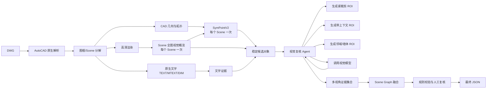

# DWG 视觉识别系统架构与数据交互设计

## 1. 文档范围

本文档定义当前版本的 DWG-only 识别架构：输入只接受 `.dwg`，优先通过本机 AutoCAD 2020-2027 ActiveX API 读取实体、字体和布局信息，再由 SymPointV2、原生文字、视觉模型和受限的视觉复核 Agent 共同生成统一的对象 JSON。

本版本明确舍弃“全局自由 CAD Agent”。系统采用固定主流程：每个 Scene 先调用一次全图视觉模型形成 Scene 级先验，再调用一次 SymPointV2；原生文字每个 Scene 一次提取；视觉模型随后允许在受限预算内进行多视角、多轮 ROI 复核；LLM 只负责视觉复核调度和证据融合，不负责自由规划整个 CAD 流程。

当前识别目标包括：

- 墙体；
- 门；
- 窗；
- 家具及卫浴器具；
- 图框、布局、房间和文字标注之间的关联；
- 图形实体与标注文字不一致的校验。

本架构将几何事实、文字事实、视觉判断和最终决策分开保存。任何模型都不能直接覆盖 DWG 的原始几何数据；Agent 只能引用已有候选和证据，不能凭空创建、删除或修改 CAD 实体。

## 2. 核心流程图

以下是本项目唯一的主架构流程。后续章节中的模块、API、Schema 和 Agent 行为都是对该流程节点的展开，不得改变节点顺序或增加全局自由 Agent。



实现说明：`D3` 生成的每个 Scene 高清渲染先调用一次视觉模型，得到 `visual_scene_overview.v1`；该结果只作为先验和待复核区域提示，不能覆盖原生文字、几何或 Handle。随后调用 SymPointV2，每个 Scene 仍只调用一次；视觉复核 Agent 再按固定 ROI 模板和预算执行多次复核。LLM 可以作为 `Scene Graph 融合` 节点内部的结构化融合器，但不能成为独立的全局 Agent。

## 3. 设计原则

### 3.1 DWG 原生信息优先

DWG 中的实体、块、图层、文字、尺寸和布局信息优先通过 AutoCAD 原生 API 读取。由于当前假设所有文字都可以直接读取，不设置 OCR 作为主链路；OCR 只作为未来处理异常代理对象或扫描底图的扩展能力。

### 3.2 图框是推理边界

一张 DWG 可能包含多个 Model Space 区域、Paper Space Layout、Viewport 或多个矩形图框。每个图框先生成独立 `scene`，再进入模型。

不要把多个图框直接合并成一个 SymPointV2 输入，否则会把标题栏、尺寸标注和多个互不相关的平面混在一起，破坏坐标归一化和局部上下文。

### 3.3 几何与语义分工

SymPointV2 负责图元级几何实例；视觉大模型负责开放类别、细分类别和图文语义；文字分支负责精确的原生文字；规则引擎负责最终一致性判断。

视觉模型可以把 `furniture` 细分为 `wall_hung_toilet`，但不应成为墙线坐标、门窗尺寸和实体 Handle 的唯一来源。

### 3.4 所有结果都回到世界坐标

模型可以在局部坐标、归一化坐标或像素坐标中运行，但模块交互和最终 JSON 必须保留：

- `scene_id`；
- `coordinate_space`；
- `world_bounds`；
- `local_origin`；
- `pixel_to_world` 或 `local_to_world` 变换；
- `entity_handle` / `primitive_id`。

### 3.5 Agent 只存在于视觉复核边界内

本项目不采用全局自由 Agent。Agent 的边界固定在视觉复核阶段，只能在给定候选对象上选择受控的 ROI 视图、调用视觉模型、比较多次观察并请求结束或人工复核。

Agent 不得：

- 自由规划整个 CAD 处理流程；
- 任意调用系统命令或修改 DWG；
- 修改 CAD 原生坐标、尺寸或 Handle；
- 删除 SymPointV2 产生的候选；
- 凭空创建没有几何证据的对象；
- 无限循环调用视觉模型；
- 用最后一次模型结果覆盖全部历史证据。

### 3.6 按字段使用证据优先级

“标注文本通常比符号画法可靠”作为业务先验，但不做全局无条件覆盖。不同字段使用不同的权威来源：

| 字段 | 默认优先级 |
|---|---|
| 语义类别和设备名称 | 引线/块属性/原生文字 > 多视角视觉 > SymPointV2 类别 |
| 世界坐标、边界和尺寸 | AutoCAD 原生几何 > SymPointV2 > 视觉框 |
| 旋转和拓扑关系 | AutoCAD 原生几何与规则 > SymPointV2 > 视觉判断 |
| 家具、洁具细分类别 | 原生文字 + 多视角视觉 + 几何关系 |
| 是否冲突、是否复核 | LLM 综合证据，规则引擎最终约束 |

文字首先要经过标注归属判断。标题栏、图例、尺寸文字、房间名称和孤立文字不能与直接指向对象的 MLeader、Block Attribute 享有相同权重。

### 3.7 稳定主链路与可变增强链路分离

稳定主链路为：

```text
DWG → AutoCAD 原生解析 → Scene 分解 → 原生文字/高清渲染
    → 每 Scene 一次全图视觉概览 → SymPointV2 → 确定性候选关联
```

可变增强链路为：

```text
候选对象 → 受限视觉复核 Agent → 多视角视觉模型 → LLM 证据融合 → 规则校验
```

即使视觉模型、LLM 或 Agent 不可用，系统仍应输出 CAD 几何、文字和 SymPointV2 基线结果。

## 4. 模块划分

| 模块 | 建议实现 | 输入 | 输出 | 主要职责 |
|---|---|---|---|---|
| `DwgExtractor` | Python ActiveX（AutoCAD 2020-2027）；C# 插件按版本编译 | DWG | `dwg_raw.json`、布局与渲染任务 | 读取实体、块、文字、字体、图层和布局 |
| `DwgBridge` | Python ActiveX/COM | DWG | 同上 | 无需编译插件时的本机复现入口 |
| `FrameDetector` | Python/C# | 原生实体与布局 | `frames.json` | 识别图框、Viewport 和场景边界 |
| `SceneBuilder` | Python | 原生实体、图框 | `scene_*.json` | 过滤标题栏、切分场景、建立坐标变换 |
| `VectorAdapter` | Python | 场景图元 | `sympoint_input.json` | 转换为 SymPointV2 所需的二维图元点特征 |
| `TextExtractor` | C# 优先 | DWG 原生文字实体 | `text_evidence.json` | 读取 TEXT、MTEXT、属性、引线、尺寸和表格 |
| `RasterRenderer` | AutoCAD/本地渲染器 | 场景 | PNG 与渲染清单 | 生成视觉模型输入图 |
| `SymPointWorker` | Python + PyTorch | `sympoint_input.json` | `sympoint_result.json` | 每个 Scene 一次，产生稳定几何基线 |
| `SceneOverview` | Python 固定调用 + 视觉模型 | Scene 高清图、文字摘要 | `scene_overview.json` | 每个 Scene 一次，产生全局先验和待复核区域 |
| `VisualReviewAgent` | Python 固定状态机 + 视觉模型 | Scene 概览、候选、渲染清单、文字摘要 | `visual_review_trace.json` | 受限选择 ROI、有限次调用视觉模型、比较观察 |
| `VisionWorker` | Python | 单个 ROI 图片与固定提示 | `vision_observation.json` | 单次视觉观察，不负责全局融合 |
| `CandidateLinker` | Python 规则 | 各分支结果 | `linked_candidates.json` | 按 ID、坐标、邻接和文字近邻建立候选关联 |
| `LLMFusionResolver` | Python + LLM | 已关联候选与证据 | `fusion_decision.json` | 字段级语义裁决，不生成新几何 |
| `SceneGraphCommitter` | Python 规则 | 融合决策与原始证据 | `scene_graph.json` | Schema 校验后提交正式场景图 |
| `Validator` | Python | 场景图、文字和几何 | `validation.json` | 检查空间关系、文字冲突、尺寸异常和重复 |
| `JsonWriter` | Python | 最终场景图 | `detection.json` | 输出稳定的外部 API JSON |

## 5. 端到端详细流程

### 5.1 接收任务

入口只接受 DWG，并为每次任务创建隔离的运行目录。

```json
{
  "job_id": "job_20260824_0001",
  "input": {
    "path": "E:/plans/plan_01.dwg",
    "format": "dwg"
  },
  "options": {
    "autocad_mode": "plugin",
    "read_text": true,
    "render_dpi": 300,
    "run_sympoint": true,
    "run_vision": true,
    "visual_review": {
      "max_attempts_per_object": 3,
      "max_attempts_per_scene": 30,
      "allowed_view_profiles": ["tight", "context", "wall_context", "text_context"],
      "stop_on_agreement": true
    }
  }
}
```

入口校验：

1. 文件扩展名必须是 `.dwg`；
2. 文件可读且未被锁定；
3. AutoCAD 连接或插件可用；
4. 输出目录不存在冲突；
5. 记录 AutoCAD、插件、字体和模型版本。

### 5.2 AutoCAD 原生提取

`DwgExtractor` 在 AutoCAD 进程内读取以下对象：

- `Line`、`Polyline`、`Arc`、`Circle`、`Ellipse`；
- `BlockReference` 及其块定义；
- `DBText`、`MText`；
- `AttributeReference`；
- `MLeader`；
- `Dimension`；
- `Table`；
- Model Space、Paper Space 和 Layout Viewport。

每个实体都要保留原始 Handle，必要时保留块引用与块内子实体的父子关系。

```json
{
  "entity_id": "ent_00031",
  "handle": "7A3",
  "entity_type": "Polyline",
  "space": "ModelSpace",
  "layout_id": null,
  "layer": "A-WALL",
  "color": 256,
  "linetype": "Continuous",
  "lineweight": 25,
  "closed": true,
  "geometry_world": {
    "points": [[1000.0, 2000.0], [5000.0, 2000.0], [5000.0, 2200.0], [1000.0, 2200.0]],
    "bbox": [1000.0, 2000.0, 5000.0, 2200.0]
  },
  "block_context": [],
  "source": "autocad_2026_api"
}
```

### 5.3 图框和场景分解

`FrameDetector` 按以下优先级确定场景边界：

1. Layout 中的 Viewport 范围；
2. 明确的图框 BlockReference；
3. 闭合矩形 Polyline；
4. 图层名、块名和空间关系辅助判断；
5. 无法识别图框时，以有效建筑实体的整体范围生成一个 fallback scene。

场景检测结果：

```json
{
  "scene_id": "scene_model_01_frame_03",
  "frame_type": "closed_polyline",
  "space": "ModelSpace",
  "layout_id": null,
  "world_bbox": [1000.0, 2000.0, 8500.0, 6200.0],
  "margin": 150.0,
  "effective_bbox": [850.0, 1850.0, 8650.0, 6350.0],
  "excluded_regions": [
    {"type": "title_block", "bbox": [1000.0, 2000.0, 2500.0, 2400.0]}
  ],
  "entity_ids": ["ent_00031", "ent_00032", "ent_00412"],
  "coordinate_transform": {
    "world_to_local": {"origin": [850.0, 1850.0], "scale": 1.0, "rotation_deg": 0.0},
    "local_bounds": [0.0, 0.0, 7800.0, 4500.0]
  }
}
```

场景切分规则：

- 图元与场景边界相交时保留，不按中心点简单删除；
- 跨场景的墙体保持原始 `entity_id` 和 `handle`；
- 标题栏、比例尺、指北针和图签默认排除出几何识别输入；
- 文字可以保留在 `text_evidence`，但标记为 `title_block` 或 `annotation_only`；
- 同一个实体在多个 Viewport 中重复出现时，最终以 `handle + scene_id` 管理来源。

### 5.4 原生文字提取

`TextExtractor` 不从图片识字，而是读取 DWG 原生文字内容。每条文字应保存字体、文字样式、旋转、对齐方式、位置和所属空间。

```json
{
  "text_id": "txt_00019",
  "handle": "A91",
  "text": "卫生间",
  "normalized_text": "卫生间",
  "entity_type": "MText",
  "scene_id": "scene_model_01_frame_03",
  "layout_id": null,
  "layer": "A-TEXT",
  "style": {
    "text_style": "Standard",
    "font_family": "SimSun",
    "font_file": "simsun.ttf",
    "height": 180.0,
    "width_factor": 1.0,
    "rotation_deg": 0.0
  },
  "position_world": [5200.0, 3000.0],
  "bbox_world": [5000.0, 2880.0, 5400.0, 3120.0],
  "source": "autocad_2026_api"
}
```

文字按用途分组：

- `room_label`：房间名称；
- `equipment_label`：设备或洁具文字；
- `door_window_tag`：门窗编号；
- `dimension`：尺寸或标高；
- `legend`：图例；
- `title_block`：图签；
- `general_annotation`：普通说明。

第一版可以使用文字内容、图层、位置和正则表达式完成初始分类，后续再使用视觉模型补充歧义分类。

### 5.5 SymPointV2 输入适配

这里的“点云”是二维 CAD 图元的点表示，不是传统三维点云。每个 SVG/JSON primitive 至少包含：

- 图元 ID；
- 原始 Handle；
- 几何中心或采样点；
- 图元命令类型；
- 起止点/控制点；
- 长度；
- 线宽；
- 颜色和图层；
- 场景归一化坐标。

```json
{
  "schema_version": "sympoint_input.v1",
  "scene_id": "scene_model_01_frame_03",
  "coordinate_space": "scene_local",
  "world_bounds": [1000.0, 2000.0, 8500.0, 6200.0],
  "local_bounds": [0.0, 0.0, 7800.0, 4500.0],
  "primitives": [
    {
      "primitive_id": "prim_0001",
      "entity_id": "ent_00031",
      "handle": "7A3",
      "command": "polyline",
      "points_local": [[150.0, 150.0], [4150.0, 150.0], [4150.0, 350.0], [150.0, 350.0]],
      "center_local": [2150.0, 250.0],
      "length": 8000.0,
      "width": 200.0,
      "layer": "A-WALL",
      "color": 256
    }
  ]
}
```

如果一个 Scene 的 primitive 数量过大，不随机丢弃图元，而是按 `local_bounds` 做矢量空间窗口切分：

- 窗口之间保留可配置重叠；
- 跨窗口实体共享 `entity_id` 和 `handle`；
- 每个窗口保存 `window_id`、`window_bbox_world` 和坐标变换；
- 推理后按全局 ID 和世界坐标去重。

### 5.6 SymPointV2 输出

SymPointV2 输出保持几何事实和模型类别分离：

```json
{
  "schema_version": "sympoint_result.v1",
  "scene_id": "scene_model_01_frame_03",
  "window_id": null,
  "instances": [
    {
      "instance_id": "spv_0007",
      "class_id": 27,
      "class_name": "toilet",
      "primitive_ids": ["prim_0181", "prim_0182"],
      "entity_ids": ["ent_00881"],
      "bbox_local": [4300.0, 1200.0, 4650.0, 1500.0],
      "polygon_local": [[4300.0, 1200.0], [4650.0, 1200.0], [4650.0, 1500.0], [4300.0, 1500.0]],
      "bbox_world": [5300.0, 3050.0, 5650.0, 3350.0],
      "confidence": 0.84,
      "model": "SymPointV2"
    }
  ]
}
```

### 5.7 场景渲染和视觉大模型

视觉分支使用与 Scene 对应的高清图。渲染时生成 `render_manifest.json`，明确图像尺寸和坐标变换。

```json
{
  "scene_id": "scene_model_01_frame_03",
  "image_path": "scenes/scene_model_01_frame_03/rendered.png",
  "width_px": 6400,
  "height_px": 3600,
  "background": "white",
  "render": {
    "dpi": 300,
    "lineweight_scale": 1.0,
    "font_source": "autocad_native"
  },
  "pixel_to_world": {
    "origin_world": [850.0, 1850.0],
    "scale_x": 1.21875,
    "scale_y": 1.25,
    "rotation_deg": 0.0,
    "y_axis": "down"
  },
  "text_ids": ["txt_00019", "txt_00020"]
}
```

视觉模型请求不是只发送一张图片，还应发送结构化上下文：

```json
{
  "request_id": "vision_req_0008",
  "scene_id": "scene_model_01_frame_03",
  "image": {
    "path": "scenes/scene_model_01_frame_03/rendered.png",
    "coordinate_space": "pixel",
    "width": 6400,
    "height": 3600
  },
  "nearby_text": [
    {
      "text_id": "txt_00019",
      "text": "卫生间",
      "bbox_px": [3400, 1100, 3800, 1260]
    }
  ],
  "spv_candidates": [
    {
      "instance_id": "spv_0007",
      "class_name": "toilet",
      "bbox_px": [4300, 1200, 4650, 1500]
    }
  ],
  "task": "refine_and_validate"
}
```

视觉模型只返回可审计的观察，不返回隐藏思维链：

```json
{
  "request_id": "vision_req_0008",
  "scene_id": "scene_model_01_frame_03",
  "observations": [
    {
      "observation_id": "vlm_0012",
      "category": "wall_hung_toilet",
      "bbox_px": [4305, 1205, 4640, 1495],
      "polygon_px": [],
      "matched_spv_instance_ids": ["spv_0007"],
      "nearby_text_ids": [],
      "confidence": 0.79,
      "evidence": "器具轮廓靠墙，后侧可见水箱或安装线条",
      "uncertainty": ["未能确认具体品牌和尺寸"]
    }
  ],
  "notes": "SPV2 的 toilet 结果可以细分为 wall_hung_toilet"
}
```

### 5.8 受限视觉复核 Agent

视觉模型对裁剪位置和上下文敏感，因此视觉分支允许多次调用。但多次调用必须由固定状态机和预算控制，不能演变为全局自由 Agent。

#### 5.8.1 Agent 输入

Agent 只接收已经确定的候选对象、Scene 坐标、原生文字和渲染清单：

```json
{
  "visual_task_id": "vt_00031",
  "scene_id": "scene_model_01_frame_03",
  "object_id": "obj_000123",
  "base_candidates": [
    {
      "source": "sympointv2",
      "instance_id": "spv_0007",
      "class_name": "toilet",
      "bbox_world": [5300.0, 3050.0, 5650.0, 3350.0],
      "confidence": 0.84
    }
  ],
  "text_evidence": [
    {
      "text_id": "txt_00031",
      "text": "WC",
      "relation": "near",
      "distance_world": 210.0
    }
  ],
  "allowed_view_profiles": ["tight", "context", "wall_context", "text_context"],
  "budget": {
    "max_attempts": 3,
    "used_attempts": 0,
    "timeout_ms": 30000
  }
}
```

#### 5.8.2 固定视图策略

Agent 不能随意生成任意裁剪，而应从受控视图模板中选择：

| 视图模板 | 作用 |
|---|---|
| `tight` | 判断对象自身符号和轮廓 |
| `context` | 判断房间和相邻对象关系 |
| `wall_context` | 判断靠墙、嵌入、壁挂等关系 |
| `text_context` | 同时显示对象与附近原生文字、引线和尺寸 |
| `overview` | Scene 级前置调用，每个 Scene 严格一次；不作为候选级重试 |

每个视图由本地渲染器根据世界坐标生成，并记录 `view_id`、`crop_world`、`crop_px` 和 `image_hash`。Agent 只能选择模板和已有候选对象，不能修改坐标变换。

#### 5.8.3 Agent 动作协议

```json
{
  "action": "call_vision",
  "visual_task_id": "vt_00031",
  "object_id": "obj_000123",
  "view_profile": "wall_context",
  "question_type": "subtype_confirmation",
  "reason_code": "TIGHT_VIEW_AMBIGUOUS",
  "remaining_attempts": 2
}
```

允许的动作只有：

- `render_view`：从固定模板生成 ROI；
- `call_vision`：调用一次视觉模型；
- `compare_observations`：比较当前已有观察；
- `finish`：提交结果或转人工复核。

禁止执行系统命令、修改 DWG、删除候选、改变世界坐标和无限递归调用。

#### 5.8.4 多次观察记录

视觉模型的每次输出都作为独立 observation 保存，不采用“最后一次结果覆盖前一次”的策略：

```json
{
  "visual_task_id": "vt_00031",
  "attempts": [
    {
      "attempt": 1,
      "view_profile": "tight",
      "view_id": "view_001",
      "model": "vision-model-a",
      "result": {
        "category": "sink",
        "confidence": 0.61,
        "visible_facts": ["椭圆轮廓", "局部线条"],
        "uncertainty": ["裁剪范围过紧，无法判断靠墙关系"]
      }
    },
    {
      "attempt": 2,
      "view_profile": "wall_context",
      "view_id": "view_002",
      "model": "vision-model-a",
      "result": {
        "category": "wall_hung_toilet",
        "confidence": 0.78,
        "visible_facts": ["对象靠墙", "后侧存在安装线条"],
        "uncertainty": ["无法确认品牌和精确尺寸"]
      }
    }
  ],
  "status": "needs_fusion"
}
```

视觉模型可以返回简短、可审计的 `visible_facts`、`uncertainty` 和 `contradictions`，但不保存或依赖不可验证的隐藏思维链。

#### 5.8.5 停止条件与缓存

满足下列条件之一即可结束该对象的视觉复核：

1. 两个独立视图得到相同类别；
2. 一次高置信度观察同时得到原生文字和几何关系支持；
3. 已达到最大对象调用次数；
4. 多次结果冲突，转 `review`；
5. 已经获得当前分类所需的最小证据。

所有调用必须支持缓存，缓存键至少包含：

```text
scene_id + object_id + view_profile + image_hash + model + prompt_version
```

### 5.9 候选标准化与确定性关联

LLM 融合之前，先由规则完成候选关联，避免把简单的空间匹配交给模型。

关联依据按稳定性排序：

1. 共享 `entity_id`、`handle` 或 `primitive_id`；
2. 世界坐标空间重叠或包含关系；
3. 中心点距离；
4. 相邻墙体、门洞、房间边界关系；
5. MLeader、Block Attribute 或原生文字近邻关系；
6. 视觉模型类别相似度。

候选关联输出 `linked_candidates.json`，此时只建立关系，不决定最终语义类别。

### 5.10 LLM 证据融合裁决

`LLMFusionResolver` 只处理已经关联的证据，不调用 CAD 工具，不调用系统命令，也不直接读取整张 DWG。它的输入是结构化候选和多次视觉 observation，输出是字段级决策。

默认业务先验是：对于建筑 CAD，符号画法错误的概率通常高于原生标注文本错误，因此文本对语义类别和设备名称具有更高权重；但坐标、尺寸、旋转和拓扑仍以 AutoCAD 几何为准。

LLM 输出只能引用已有 `object_id`、`text_id`、`view_id` 和 observation，不生成新的几何：

```json
{
  "schema_version": "fusion_decision.v1",
  "scene_id": "scene_model_01_frame_03",
  "decisions": [
    {
      "object_id": "obj_000123",
      "field_decisions": {
        "semantic_class": {
          "value": "wall_hung_toilet",
          "status": "confirmed",
          "supporting_evidence": ["txt_00031", "view_002", "near_wall"]
        },
        "geometry": {
          "action": "keep_cad_geometry",
          "status": "confirmed"
        }
      },
      "action": "refine",
      "confidence": 0.88,
      "reason_code": "TEXT_AND_MULTIVIEW_AGREE"
    }
  ]
}
```

LLM 不允许直接输出或修改 `bbox_world`、`polygon_world`、`rotation_deg` 和 `entity_handles`。这些字段必须来自 CAD 或已经完成坐标映射的候选。

决策状态包括：

- `same`：多个来源指向同一对象；
- `refine`：视觉模型提供更细的 subtype；
- `conflict`：来源之间存在类别、位置或文字冲突；
- `review`：证据不足，需要人工复核。

视觉模型发现的新增对象必须先经过候选标准化和坐标验证，不能在融合阶段由 LLM 直接创建。

### 5.11 Scene Graph 正式提交

`SceneGraphCommitter` 在 LLM 决策之后执行以下检查：

1. 所有 `object_id` 都存在于候选集合；
2. 所有证据 ID 都存在；
3. 类别属于版本化 taxonomy；
4. 几何字段没有被 LLM 修改；
5. 不存在重复提交或非法合并；
6. 决策状态、置信度和来源完整；
7. 不通过 Schema 的结果不能进入正式 Scene Graph。

只有通过提交检查的对象，才能进入 `scene_graph.json` 和最终 `detection.json`。

### 5.12 统一场景图融合结果

以下是正式 Scene Graph 对象的示例。它只引用前面生成的几何、文字和视觉证据：

```json
{
  "object_id": "obj_000123",
  "scene_id": "scene_model_01_frame_03",
  "type": "furniture",
  "subtype": "wall_hung_toilet",
  "geometry_world": {
    "bbox": [5300.0, 3050.0, 5650.0, 3350.0],
    "polygon": []
  },
  "rotation_deg": 90.0,
  "dimensions": {
    "width": 350.0,
    "height": 300.0,
    "units": "drawing_units"
  },
  "sources": [
    {"source": "sympointv2", "id": "spv_0007", "confidence": 0.84},
    {"source": "vision_llm", "id": "vlm_0012", "confidence": 0.79}
  ],
  "evidence": {
    "primitive_ids": ["prim_0181", "prim_0182"],
    "entity_handles": ["A81", "A82"],
    "text_ids": [],
    "visual_observation_ids": ["vlm_0012"]
  },
  "decision": {
    "status": "confirmed",
    "confidence": 0.87,
    "method": "geometry_anchor_visual_refinement"
  }
}
```

### 5.13 校验和冲突处理

校验模块不改变原始证据，只生成问题记录。

典型规则包括：

| 规则 | 示例 |
|---|---|
| 文字-对象类别 | 文字为“洗手盆”，视觉结果却为马桶 |
| 房间-对象合理性 | 普通卧室中出现大量厨房设备 |
| 墙体关系 | 马桶、洗手盆等器具完全悬空且远离墙体 |
| 门墙关系 | 门不靠近墙体或没有合理门洞 |
| 窗墙关系 | 窗不位于墙边或窗宽明显超出墙段 |
| 尺寸异常 | 对象尺寸远超同场景统计范围 |
| 重复对象 | 相邻重叠窗口重复识别同一对象 |
| 输出容量 | 场景对象数量接近模型查询上限 |
| 图框污染 | 标题栏、图例被识别为家具或墙体 |

问题格式：

```json
{
  "issue_id": "issue_0004",
  "scene_id": "scene_model_01_frame_03",
  "object_ids": ["obj_000123"],
  "severity": "warning",
  "code": "TEXT_GEOMETRY_CONFLICT",
  "message": "附近标注为“洗手盆”，但视觉模型细分类别为 wall_hung_toilet",
  "evidence": {
    "text_ids": ["txt_00031"],
    "visual_observation_ids": ["vlm_0012"],
    "distance_world": 210.0
  },
  "recommended_action": "review"
}
```

### 5.14 最终输出

最终 `detection.json` 保持外部接口稳定，原始证据和中间结果可以作为审计字段保留。

```json
{
  "schema_version": "dwg-detection.v2",
  "job_id": "job_20260824_0001",
  "source": {
    "path": "E:/plans/plan_01.dwg",
    "format": "dwg",
    "autocad_version": "2026"
  },
  "coordinate_system": {
    "space": "world",
    "units": "drawing_units",
    "world_bounds": [0.0, 0.0, 12000.0, 8000.0]
  },
  "scenes": [
    {
      "scene_id": "scene_model_01_frame_03",
      "world_bbox": [1000.0, 2000.0, 8500.0, 6200.0],
      "entity_count": 1860,
      "text_count": 27,
      "status": "completed"
    }
  ],
  "entities": [],
  "annotations": [],
  "model_runs": [],
  "validation": {
    "status": "warning",
    "issues": [],
    "summary": {"error": 0, "warning": 1, "info": 5}
  }
}
```

## 6. 推荐的运行目录

```text
runs/<job_id>/
├─ input.dwg
├─ dwg_raw.json
├─ frames.json
├─ scenes/
│  ├─ scene_001/
│  │  ├─ scene.json
│  │  ├─ text_evidence.json
│  │  ├─ render_manifest.json
│  │  ├─ rendered.png
│  │  ├─ sympoint_input.json
│  │  ├─ sympoint_result.json
│  │  ├─ visual_review_trace.json
│  │  ├─ linked_candidates.json
│  │  ├─ fusion_decision.json
│  │  └─ vision_result.json
├─ scene_graph.json
├─ validation.json
└─ detection.json
```

## 7. 失败与降级策略

| 失败位置 | 降级行为 |
|---|---|
| AutoCAD 插件不可用 | 尝试 Python ActiveX；仍失败则任务失败，不伪造原生几何 |
| 某个 Layout 无法读取 | 跳过该 Layout，并在 validation 中记录 |
| 图框检测失败 | 使用有效实体整体范围创建 fallback scene |
| SymPointV2 不可用 | 保留原生几何和视觉候选，标记 `sympoint_unavailable` |
| 视觉模型不可用 | 输出几何和文字结果，标记 `vision_unavailable` |
| 文本实体解析失败 | 保留原始 Handle 和原始内容，标记 `text_parse_warning` |
| 场景点数过大 | 改用带重叠的矢量窗口，不随机删除实体 |
| 视觉复核 Agent 超时 | 保留已完成 observation，转 `review`，不阻塞其它 Scene |
| 视觉复核达到预算 | 使用已有证据进行融合；无法确认则标记 `review` |
| LLM 融合不可用 | 使用确定性关联和默认文本优先策略，标记 `llm_fusion_unavailable` |
| LLM 输出 Schema 无效 | 丢弃本次决策，最多进行一次修复调用，失败则走规则降级 |
| 来源冲突 | 保留全部来源，最终对象标记 `review` |

## 8. 版本化与可追溯性

每次任务至少记录：

- `schema_version`；
- AutoCAD 版本和插件版本；
- DWG 文件哈希；
- 使用的字体文件及哈希；
- SymPointV2 权重版本；
- 视觉模型名和调用时间；
- 视觉复核 Agent 策略版本、动作轨迹和调用预算；
- 每次 ROI 的视图模板、坐标范围和图片哈希；
- LLM 融合模型名、融合 Prompt 版本和输出修复次数；
- Prompt 版本；
- 坐标变换版本；
- 规则集版本。

模型只输出简短、可审计的 `evidence`，不保存隐藏思维链。这样可以复盘“为什么判断为某类”，同时不会把不可验证的模型内部推理当作工程事实。

## 9. 与当前代码的映射

当前仓库已有的能力可以直接对应到：

- `dwg_vision/autocad_bridge.py`：Python 侧 AutoCAD/几何桥接；
- `autocad_2026/DwgVisionExport.cs`：按目标 AutoCAD/.NET SDK 编译的进程内原生导出插件；Python ActiveX 是 2020-2027 主链路；
- `dwg_vision/geometry.py`：矢量证据和几何启发式；
- `dwg_vision/tiling.py`：视觉分支的图片切片和拼图；
- `dwg_vision/providers.py`：视觉模型 Provider；
- `dwg_vision/reconcile.py`：现有候选合并基础，后续拆分为确定性关联和 LLM 融合；
- `dwg_vision/validation.py`：一致性校验；
- `dwg_vision/schema.py`：外部 JSON 基础契约。

后续新增模块建议优先实现：

1. `dwg_vision/scenes.py`：图框检测和 Scene 构建；
2. `dwg_vision/text_evidence.py`：原生文字统一格式化；
3. `dwg_vision/sympoint_adapter.py`：Scene 到 SymPointV2 的输入和输出适配；
4. `dwg_vision/visual_review_agent.py`：固定视图模板、预算和多次视觉调用状态机；
5. `dwg_vision/candidate_linker.py`：ID、坐标、邻接和文字近邻的确定性关联；
6. `dwg_vision/llm_fusion.py`：字段级 LLM 证据融合和 Schema 解析；
7. `dwg_vision/scene_graph.py`：统一对象、来源和关系；
8. `dwg_vision/rules.py`：文字、几何和空间常识校验。
