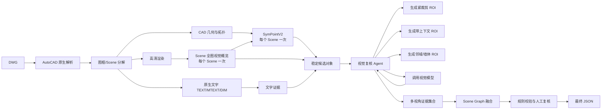

# SymPointV2 云端推理接口开发文档

## 1. 文档目的

本文档用于指导 OpenCode 将已经在 AutoDL 云服务器跑通的 `SymPointV2-Infer` 改造成可被本地 DWG 主流程调用的推理接口。

本方案只处理 DWG 输入，不要求云端安装 AutoCAD，也不要求 AutoDL 暴露公共 HTTP 端口。开发和运行通过 VS Code Remote SSH、SSH 端口转发或 SSH 批处理完成。

必须遵守以下架构决策：

1. Windows 本地负责 AutoCAD 原生 DWG 解析、布局和图框分解、原生文字提取、Scene 坐标管理。
2. AutoDL 云端负责 Scene 到 SymPointV2 模型输入的转换、模型推理和原语级结果输出。
3. SymPointV2 默认每个 Scene 只做一次前向推理，不采用视觉模型式的多轮裁剪重试。
4. 每个 Scene 在调用 SymPointV2 前由本地视觉模型执行一次全图概览；该调用不放进 SymPointV2 服务。
5. 视觉模型的多次 ROI 复核属于另一条本地链路，不放进 SymPointV2 服务。
6. 云端返回原语索引、类别和置信度；最终世界坐标、CAD Handle 关联和 Scene Graph 融合由本地完成。
7. 结果必须可重试、可缓存、可追溯，不能依赖公共端口或人工复制文件。

相关总架构文档：[DWG 视觉识别系统架构与数据交互设计](DWG_VISION_ARCHITECTURE.md)。

本接口文档必须服从以下唯一主架构流程。本文档只展开其中的 `D1 → E → G` 云端实现以及 Bundle、结果回传和本地映射，不改变视觉复核 Agent 和 Scene Graph 的整体顺序：



`Scene Graph 融合` 内部可以调用 LLM 进行结构化证据融合，但云端 SymPointV2 API 不实现全局 Agent，也不重复调用 SymPointV2。

## 2. 部署边界

```text
┌──────────────────────── Windows 本地 ────────────────────────┐
│                                                              │
│  AutoCAD 2020-2027 / Python ActiveX（C#按版本增强）       │
│        │                                                     │
│        ▼                                                     │
│  DWG 原生实体、字体、布局、图框、文字                        │
│        │                                                     │
│        ▼                                                     │
│  SceneBuilder                                               │
│  - 一个图框 = 一个 Scene                                     │
│  - 保存 world 坐标和 entity Handle                           │
│  - 生成 scene.json / scene.svg                               │
│        │                                                     │
│        ├── 本地 CAD 规则、文字和视觉模型链路                 │
│        │                                                     │
│        └── SSH/SFTP/SSH Tunnel                               │
│                         │                                    │
└─────────────────────────┼────────────────────────────────────┘
                          ▼
┌──────────────────────── AutoDL Linux GPU ────────────────────┐
│                                                              │
│  SymPointV2-Infer API                                       │
│  - 模型常驻内存                                              │
│  - Scene SVG/JSON → _s2.json                                 │
│  - _s2.json → coords/features                                │
│  - 每个 Scene 一次推理                                      │
│  - 返回 primitive-level 结果                                 │
│                                                              │
└──────────────────────────────────────────────────────────────┘
```

## 3. 谁负责数据处理

这是本项目必须固定的职责边界。

| 数据处理步骤 | 执行位置 | 原因 |
|---|---|---|
| 读取 DWG、Layout、ModelSpace、PaperSpace | Windows 本地 | 依赖 AutoCAD API，云端没有 AutoCAD |
| 读取 TEXT、MTEXT、DIMENSION、MLeader、Block Attribute | Windows 本地 | 原生文字是高权重证据，必须保留 Handle 和字体信息 |
| 识别图框、Viewport 和 Scene 边界 | Windows 本地 | 依赖 DWG 空间和布局语义 |
| Scene 内实体过滤和标题栏排除 | Windows 本地 | 需要保留 entity_id、Handle 和世界坐标 |
| Scene 世界坐标到局部坐标的变换 | Windows 本地生成并保存 | 本地是坐标真相源 |
| Scene SVG/JSON 到 SymPointV2 `_s2.json` | 云端 Worker | 与模型代码放在同一环境，避免本地/云端预处理不一致 |
| `_s2.json` 到 `coords/features` 张量 | 云端 Worker | 直接复用 `svgnet/data/svg3.py` |
| SymPointV2 前向推理 | 云端 GPU | 依赖 CUDA、pointops 和模型权重 |
| primitive-level 结果反解为 CAD 世界几何 | Windows 本地 | 使用本地保存的原始图元和坐标变换 |
| 多来源融合、文字优先、视觉复核 | Windows 本地 | 统一进入主项目 Scene Graph |

结论：

> 图框拆分必须由本地 DWG 处理模块完成；点云张量化由云端 SymPointV2 Worker 完成。云端不接受原始 DWG，只接受已经切好的 Scene 包。

## 4. 多图框处理规范

### 4.1 一个图框就是一个 Scene

一个 DWG 可能存在：

- 多个 ModelSpace 图框；
- 多个 PaperSpace Layout；
- Layout 中多个 Viewport；
- 同一模型在多个 Viewport 中重复显示；
- 标题栏、图签、图例和比例尺；
- 图框外的施工说明或其它专业图。

本地 `FrameDetector` 生成如下结构：

```json
{
  "scene_id": "scene_model_01_frame_003",
  "source_dwg": "plan_01.dwg",
  "space": "ModelSpace",
  "layout_id": null,
  "frame_type": "closed_polyline",
  "world_bbox": [1000.0, 2000.0, 8500.0, 6200.0],
  "effective_bbox": [850.0, 1850.0, 8650.0, 6350.0],
  "local_origin_world": [850.0, 1850.0],
  "local_size": [7800.0, 4500.0],
  "rotation_deg": 0.0,
  "entity_ids": ["ent_001", "ent_002", "ent_003"],
  "text_ids": ["txt_001", "txt_002"],
  "excluded_regions": [
    {
      "type": "title_block",
      "bbox_world": [1000.0, 2000.0, 2500.0, 2400.0]
    }
  ]
}
```

### 4.2 图框检测优先级

按以下顺序检测：

1. Layout Viewport 的可见范围；
2. 图框 BlockReference；
3. 图层或块名明显表示图框的闭合矩形；
4. 闭合矩形 Polyline；
5. 有效建筑实体的整体范围作为 fallback Scene。

### 4.3 跨边界图元

如果墙体或其它图元跨越图框边界：

- 不直接删除；
- 保留原始 `entity_id` 和 `handle`；
- Scene 内可保存完整图元或裁剪后的局部几何；
- 若被切分，必须增加 `source_entity_id`；
- 结果合并按 `source_entity_id + handle` 去重。

### 4.4 多图框与 SymPointV2 调用次数

```text
DWG
 ├─ Scene 001 → SymPointV2 一次
 ├─ Scene 002 → SymPointV2 一次
 └─ Scene 003 → SymPointV2 一次
```

“一次调用”指每个 Scene 一次模型前向，不是把多个图框拼成一个输入。

在本地总流程中，每个 Scene 的顺序固定为：`Scene 高清渲染 → 全图视觉概览一次 → Bundle/Scene 进入 SymPointV2 一次 → 候选级 ROI 复核`。全图概览的结果由本地保存为 `scene_overview.json`，不会进入云端 Worker，也不会触发第二次 SymPointV2；云端只接收已经按图框裁剪并转为 Scene-local 坐标的 SVG/JSON。

如果某个 Scene 因点数过大必须拆成矢量窗口，则：

- 这是输入容量处理，不是视觉复核重试；
- 每个窗口只推理一次；
- 窗口必须有重叠；
- 所有窗口共享原始 `source_entity_id`；
- 结果回到本地后再按世界坐标去重。

默认先不按 2048 截断。当前 SymPointV2-Infer 的 `N` 是图元数，不足 2048 才补零；是否需要窗口切分，应由远程 Worker 的显存和实测阈值决定。

## 5. 远程服务接口

### 5.1 网络模式

服务默认只监听云端本机：

```bash
127.0.0.1:8000
```

不要求 AutoDL 公共端口。开发机通过 SSH 建立本地转发：

```bash
ssh -N -L 18080:127.0.0.1:8000 autodl-spv
```

之后 Windows 本地访问：

```text
http://127.0.0.1:18080
```

VS Code Remote SSH 只用于开发、调试和查看日志；正式任务由本地程序通过 SSH 隧道或 SCP/SFTP 自动调用。

### 5.2 服务启动

在 `SymPointV2-Infer` 项目新增：

```text
api_server.py
api/
├── schemas.py
├── job_store.py
├── worker.py
├── bundle.py
└── routes.py
```

启动命令：

```bash
./run_in_venv.sh -m uvicorn api_server:app \
  --host 127.0.0.1 \
  --port 8000 \
  --workers 1
```

必须使用 `--workers 1`，因为一个 GPU Worker 只加载一份模型，避免多个进程重复占用显存。

### 5.3 健康检查

#### `GET /healthz`

只检查进程是否存活，不触发模型加载。

响应：

```json
{
  "status": "ok",
  "service": "sympointv2-infer",
  "version": "1.0.0"
}
```

#### `GET /readyz`

检查：

- 权重文件存在；
- 配置可加载；
- CUDA 可用；
- pointops 已编译或可编译；
- 模型已经加载到 GPU。

响应：

```json
{
  "status": "ready",
  "model": "SymPointV2",
  "weights": "best.pth",
  "torch": "2.9.0+cu130",
  "cuda": "available",
  "pointops": "loaded",
  "gpu": "NVIDIA ..."
}
```

未 ready 时，推理接口必须返回 HTTP 503，而不是接受任务后静默失败。

### 5.4 创建异步任务

#### `POST /v1/jobs`

请求为 `multipart/form-data`：

- `bundle`：Scene Bundle 的 zip 文件；
- `idempotency_key`：可选，防止重复提交；
- `priority`：可选，默认 `normal`。

成功响应 HTTP 202：

```json
{
  "job_id": "job_20260826_000001",
  "status": "queued",
  "poll_url": "/v1/jobs/job_20260826_000001",
  "result_url": "/v1/jobs/job_20260826_000001/result"
}
```

一个 Job 可以包含多个 Scene。服务必须在同一个模型进程内批量处理它们，不重复加载权重。

### 5.5 查询任务

#### `GET /v1/jobs/{job_id}`

响应：

```json
{
  "job_id": "job_20260826_000001",
  "status": "running",
  "total_scenes": 3,
  "completed_scenes": 2,
  "failed_scenes": 0,
  "current_scene_id": "scene_model_01_frame_003",
  "created_at": "2026-08-26T12:00:00Z",
  "updated_at": "2026-08-26T12:00:08Z"
}
```

状态只能使用：

```text
queued
running
completed
partial_failed
failed
cancelled
```

### 5.6 获取结果

#### `GET /v1/jobs/{job_id}/result`

任务完成后返回 zip，内容为：

```text
result.zip
├── job_result.json
├── scenes/
│   ├── scene_model_01_frame_001/
│   │   ├── sympoint_result.json
│   │   └── status.json
│   └── scene_model_01_frame_002/
│       ├── sympoint_result.json
│       └── status.json
└── checksums.sha256
```

### 5.7 取消和清理

可选接口：

```text
POST   /v1/jobs/{job_id}/cancel
DELETE /v1/jobs/{job_id}
```

删除只清理 Job 临时目录，不删除模型权重、编译缓存和日志。

## 6. Scene Bundle 输入协议

### 6.1 目录结构

本地上传的 Bundle 必须是：

```text
job_bundle/
├── job_manifest.json
└── scenes/
    ├── scene_model_01_frame_001/
    │   ├── scene.json
    │   └── scene.svg
    └── scene_model_01_frame_002/
        ├── scene.json
        └── scene.svg
```

### 6.2 Job Manifest

```json
{
  "schema_version": "sympoint_job.v1",
  "job_id": "job_20260826_000001",
  "source": {
    "filename": "plan_01.dwg",
    "sha256": "..."
  },
  "model": {
    "name": "SymPointV2",
    "config": "configs/svg/svg_pointT.yaml",
    "weights": "best.pth"
  },
  "scenes": [
    {
      "scene_id": "scene_model_01_frame_001",
      "path": "scenes/scene_model_01_frame_001",
      "input_format": "svg",
      "primitive_count": 1860,
      "world_bbox": [1000.0, 2000.0, 8500.0, 6200.0],
      "local_bounds": [0.0, 0.0, 7800.0, 4500.0],
      "local_to_world": {
        "origin": [850.0, 1850.0],
        "scale": 1.0,
        "rotation_deg": 0.0
      }
    }
  ]
}
```

### 6.3 Scene JSON

`scene.json` 是本地和云端之间的坐标、图元和来源契约。云端不得修改原始字段。

```json
{
  "schema_version": "dwg_scene.v1",
  "scene_id": "scene_model_01_frame_001",
  "coordinate_space": "scene_local",
  "world_bounds": [1000.0, 2000.0, 8500.0, 6200.0],
  "local_bounds": [0.0, 0.0, 7800.0, 4500.0],
  "local_to_world": {
    "origin": [850.0, 1850.0],
    "scale": 1.0,
    "rotation_deg": 0.0
  },
  "primitives": [
    {
      "primitive_id": "prim_0001",
      "source_entity_id": "ent_00031",
      "handle": "7A3",
      "type": "polyline",
      "points_local": [[150, 150], [4150, 150], [4150, 350], [150, 350]],
      "center_local": [2150, 250],
      "length": 8000.0,
      "width": 200.0,
      "command": "line",
      "layer": "A-WALL",
      "color": 256
    }
  ]
}
```

`scene.svg` 是给 SymPointV2 `tools/parse_svg_v5.py` 使用的兼容输入。它不是整张 DWG SVG，而是由本地 `SceneBuilder` 按一个图框生成的 Scene-local SVG：`viewBox` 从 `0 0` 开始，宽高等于当前图框的局部范围，图元坐标也已经减去了图框左下角原点。云端只对这个 Scene SVG 重新执行 v5 的 `_s2.json` 转换，不接收原始 DWG，也不把多个图框合并后再推理。

本地 Bundle 同时保存一个 `scene_s2.json` 作为发送前预检产物。它由 `dwg_vision/parse_svg_v5.py` 生成，核心采样逻辑与云端 `tools/parse_svg_v5.py` 一致；云端仍以自己的 v5 解析结果为准，并通过 `primitive_count` 校验 `scene.json` 与 SVG→JSON 的图元顺序一致。

## 7. 云端预处理与推理实现

### 7.1 统一入口

在 `SymPointV2-Infer` 新增 `api/worker.py`，不要从 API 路由中直接散落调用模型代码。

```python
class SymPointRuntime:
    def load(self) -> None:
        """只加载一次配置、权重和 pointops。"""

    def infer_scene(self, scene_dir: Path, scene_meta: dict) -> dict:
        """一个 Scene 一次前向，返回 primitive-level 结果。"""
```

生命周期：

```text
进程启动
  ↓
校验 CUDA / pointops / 权重
  ↓
加载 config 和 best.pth
  ↓
等待 Job
  ↓
逐 Scene：SVG → _s2.json → tensor → 一次前向
  ↓
写入结果和 status
```

### 7.2 Scene SVG 转 `_s2.json`

复用现有 `parse_svg.py`，但必须增加 API 调用安全封装：

1. 检查 SVG `viewBox` 存在且宽高大于 0；
2. 检查 `path`、`circle`、`ellipse` 数组长度一致；
3. 推理输入没有标签时，semantic/instance 使用背景和 `-1` 占位；
4. 不允许因为缺少 ground truth 而阻止前向推理；
5. 记录实际 primitive 数量 `N`；
6. 生成的 `_s2.json` 写入 Scene 临时目录，不覆盖原始 `scene.svg`。

建议新增函数：

```python
def prepare_scene(scene_dir: Path) -> Path:
    """校验 scene.svg，并生成 scene_s2.json。"""
```

### 7.3 模型输入张量

继续复用 `svgnet/data/svg3.py` 的输入逻辑：

| 张量 | 形状 | 说明 |
|---|---|---|
| `coords` | `(N, 3)` | 图元中心，x/y 按 Scene 宽高归一化，z=0 |
| `feats` | `(N, 7)` | 角度、长度、命令 one-hot、线宽 |
| `labels` | `(N, 2)` | 无标签推理时使用占位值 |
| `offsets` | `(B,)` | 本次输入的 Scene 累计点数 |
| `lengths` | `(N,)` | 图元长度 |
| `layerIds` | `(N,)` | 图层编号 |

注意：

- `N < 2048` 时按现有实现补零；
- `N > 2048` 默认保留，不随机丢点；
- 补零区域不能被转换成真实实例；
- 结果输出时必须只保留真实 primitive 范围 `0:N_real`。

### 7.4 一次前向结果

云端返回的核心结果必须以 `primitive_id` 或 primitive index 为主：

```json
{
  "schema_version": "sympoint_result.v1",
  "job_id": "job_20260826_000001",
  "scene_id": "scene_model_01_frame_001",
  "input": {
    "primitive_count": 1860,
    "padded_count": 2048,
    "model_input": "scene_s2.json"
  },
  "instances": [
    {
      "instance_id": "spv_scene001_0007",
      "class_id": 26,
      "class_name": "toilet",
      "score": 0.84,
      "primitive_indices": [181, 182],
      "primitive_ids": ["prim_0181", "prim_0182"]
    }
  ],
  "semantic_by_primitive": [
    {
      "primitive_index": 181,
      "primitive_id": "prim_0181",
      "class_id": 26,
      "class_name": "toilet",
      "score": 0.84
    }
  ],
  "provenance": {
    "model": "SymPointV2",
    "weights_sha256": "...",
    "config_sha256": "...",
    "runtime_version": "sympoint-api-1.0.0"
  }
}
```

云端不需要返回最终 `bbox_world` 作为权威结果。若返回局部 bbox，只能作为缓存或展示信息；本地必须根据 `primitive_ids` 和 `scene.json` 原始几何重新计算世界坐标。

## 8. 本地结果回映射

云端结果下载后，本地执行：

```text
primitive_ids
    ↓
scene.json 原始几何
    ↓
局部 polygon / bbox
    ↓
local_to_world
    ↓
entity_handle / source_entity_id
    ↓
Scene Graph 候选对象
```

本地输出对象至少包含：

```json
{
  "object_id": "obj_scene001_0007",
  "scene_id": "scene_model_01_frame_001",
  "type": "furniture",
  "subtype": "toilet",
  "geometry_world": {
    "bbox": [5300.0, 3050.0, 5650.0, 3350.0],
    "polygon": []
  },
  "source_handles": ["A81", "A82"],
  "sources": [
    {
      "source": "sympointv2",
      "remote_job_id": "job_20260826_000001",
      "remote_instance_id": "spv_scene001_0007",
      "score": 0.84
    }
  ],
  "coordinate_space": "world"
}
```

## 9. 本地调用客户端

在主项目新增：

```text
dwg_vision/remote_sympoint.py
dwg_vision/scene_bundle.py
dwg_vision/coordinate_mapping.py
```

建议接口：

```python
class SymPointRemoteClient:
    def health(self) -> dict: ...
    def submit_bundle(self, bundle_path: Path, idempotency_key: str) -> dict: ...
    def wait_job(self, job_id: str, timeout_s: int = 1800) -> dict: ...
    def download_result(self, job_id: str, output_dir: Path) -> Path: ...
    def infer_scenes(self, scenes: list[Path], output_dir: Path) -> list[dict]: ...
```

本地客户端必须支持两种模式：

### 9.1 HTTP 隧道模式

适用于 API 服务已经通过 SSH 转发到本地：

```text
base_url = http://127.0.0.1:18080
```

### 9.2 SSH 批处理模式

适用于暂时不启动 API 服务：

```text
打包 → scp 上传 → ssh 执行 run_job.sh → scp 下载 → 校验结果
```

客户端上层接口不应感知底层模式，统一返回 `job_id`、状态和结果路径。

## 10. 失败、重试和幂等

### 10.1 可重试错误

- SSH 短暂断开；
- HTTP 连接超时；
- Job 查询超时；
- 单个 Scene 临时文件损坏；
- GPU 推理偶发失败。

### 10.2 不应自动重试的错误

- SVG `viewBox` 非法；
- primitive 数组长度不一致；
- 模型权重不存在；
- pointops 编译失败；
- CUDA 不可用；
- Schema 不兼容；
- `scene_id` 重复但输入哈希不同。

### 10.3 幂等键

幂等键建议为：

```text
sha256(job_manifest.json) + model + weights_sha256 + config_sha256
```

相同幂等键重复提交时，应返回已有 Job，而不是再次占用 GPU。

### 10.4 单 Scene 失败

一个 Scene 失败不能导致其它 Scene 的结果丢失。Job 允许 `partial_failed`，并在结果中记录：

```json
{
  "scene_id": "scene_model_01_frame_004",
  "status": "failed",
  "error_code": "INVALID_SVG_VIEWBOX",
  "message": "viewBox width/height must be positive"
}
```

## 11. 安全和数据管理

- API 默认只绑定 `127.0.0.1`；
- 不在代码中写 SSH 密钥、API Key 或模型服务密钥；
- Job 临时目录按 `job_id` 隔离；
- 结果下载前校验 SHA256；
- 任务完成后按保留策略清理 Scene Bundle；
- DWG 只在本地解析，云端只接收必要的 Scene 数据；
- 日志中不打印完整 DWG 路径、文字内容和敏感图纸信息；
- API 不能接受任意本地路径作为输入，避免路径穿越和读取云端文件。

## 12. OpenCode 实施任务清单

### 12.1 云端 SymPointV2-Infer

1. 新增 `api_server.py`，默认监听 `127.0.0.1:8000`；
2. 新增 Pydantic 请求/响应 Schema；
3. 新增 `SymPointRuntime`，启动时只加载一次模型；
4. 封装现有 `parse_svg.py`，实现无标签 Scene 的安全预处理；
5. 封装 `svgnet/data/svg3.py`，实现单 Scene 一次推理；
6. 输出 `primitive_indices` 和 `primitive_ids`；
7. 增加 Job 状态和磁盘任务目录；
8. 实现 `/healthz`、`/readyz`、`/v1/jobs`、任务查询和结果下载；
9. 增加单元测试、接口测试和真实 GPU 冒烟测试；
10. 增加 `run_api.sh` 和 `run_batch.sh`。

### 12.2 Windows 主项目

1. 增加 DWG Scene Bundle 生成器；
2. 确保每个图框生成唯一 `scene_id`；
3. 保留 `entity_handle`、`source_entity_id` 和世界坐标；
4. 生成兼容的 `scene.svg` 和 `scene.json`；
5. 增加 SSH/HTTP 两种远程客户端实现；
6. 下载后按 `primitive_id` 反算世界坐标；
7. 将 SymPointV2 结果接入现有 Reconcile/Scene Graph；
8. 增加文字高权重和视觉多轮复核 Agent；
9. 增加远程失败降级为本地 CAD + 文字 + VLM；
10. 增加端到端 DWG 测试。

## 13. 验收标准

### 13.1 云端服务

- `GET /healthz` 返回 200；
- `GET /readyz` 能报告 CUDA、pointops、权重状态；
- API 进程只占用一份模型显存；
- 一个 Job 包含多个 Scene 时模型只加载一次；
- 每个 Scene 只产生一次 SymPointV2 forward；
- 结果中每个 `primitive_id` 都能在输入 Scene 找到；
- 补零点不会出现在实例结果中；
- 单个 Scene 失败不会丢失其它 Scene 结果。

### 13.2 本地主流程

- 一个含多个图框的 DWG 能生成多个独立 Scene；
- 图框外标题栏和图例不会直接进入 SymPointV2 主输入；
- Scene 结果能正确映射回 DWG 世界坐标；
- 同一个 Handle 在多个 Viewport 中可去重；
- 原生文字可以进入最终融合证据；
- 云端不可用时仍能生成可审计的降级结果；
- 远程结果经过哈希和 Schema 校验后才进入 Scene Graph。

### 13.3 最小测试样本

至少准备以下测试 DWG：

1. 单图框、单 Scene；
2. 多 ModelSpace 图框；
3. 多 Layout 和 Viewport；
4. 含标题栏、图例和尺寸标注；
5. 同一模型被多个 Viewport 重复显示；
6. 一个 Scene 图元数低于 2048；
7. 一个 Scene 图元数高于 2048；
8. 含门、窗、墙和多种家具的综合图。

## 14. 第一阶段实现顺序

```text
阶段 1：云端本地 API
  ├─ 模型常驻
  ├─ /healthz /readyz
  ├─ 单 Scene POST
  └─ 返回 primitive-level JSON

阶段 2：云端异步 Job
  ├─ Bundle 上传
  ├─ 多 Scene 批处理
  ├─ 状态查询
  └─ 结果下载

阶段 3：Windows Scene Bundle
  ├─ 图框分解
  ├─ scene.json / scene.svg
  ├─ 坐标回映射
  └─ Handle 关联

阶段 4：主架构接入
  ├─ SymPointV2 结果进入 Scene Graph
  ├─ 原生文字高权重融合
  ├─ 视觉复核 Agent
  └─ 端到端 detection.json
```

第一阶段不要同时实现多图框、视觉 Agent 和全量融合。先用一个已知 Scene 验证：上传、预处理、一次前向、结果下载、primitive ID 对齐和坐标回映射全部正确，再扩展到多 Scene。
